# Cutting Solder Stencils for an Eagle Designed Board

### Useful Links
[K-40manual](K-40manual.pdf)

## Part 1. Exporting the DXF File

**Requirements**

* EagleCAD
* Eagle Board (.brd) file
* Parchment Paper

### Exporting from EAGLE

Copy [cream-dxf.ulp](https://github.com/SWITCHSCIENCE/ssci-eagle-public/raw/master/cream-dxf.ulp) to your EAGLE ulp folder.

1. Right click the link above and click "Save Link As".
2. ULP Folder Location is in  "My Documents/eagle/ulps" for Eagle 9.1.1 and above
3. For older versions of Eagle, it’s located in your Eagle folder in "C:/Program Files/eagle/ulp" or where-ever you installed Eagle.

To export DXF files for top and bottom surface-mount pads (cream layers):

1. Open the board file.

2. File/Run ULP -> cream-dxf.ulp (the DXF exporter above). (or type ‘run cream-dxf.ulp’ into the command line)

    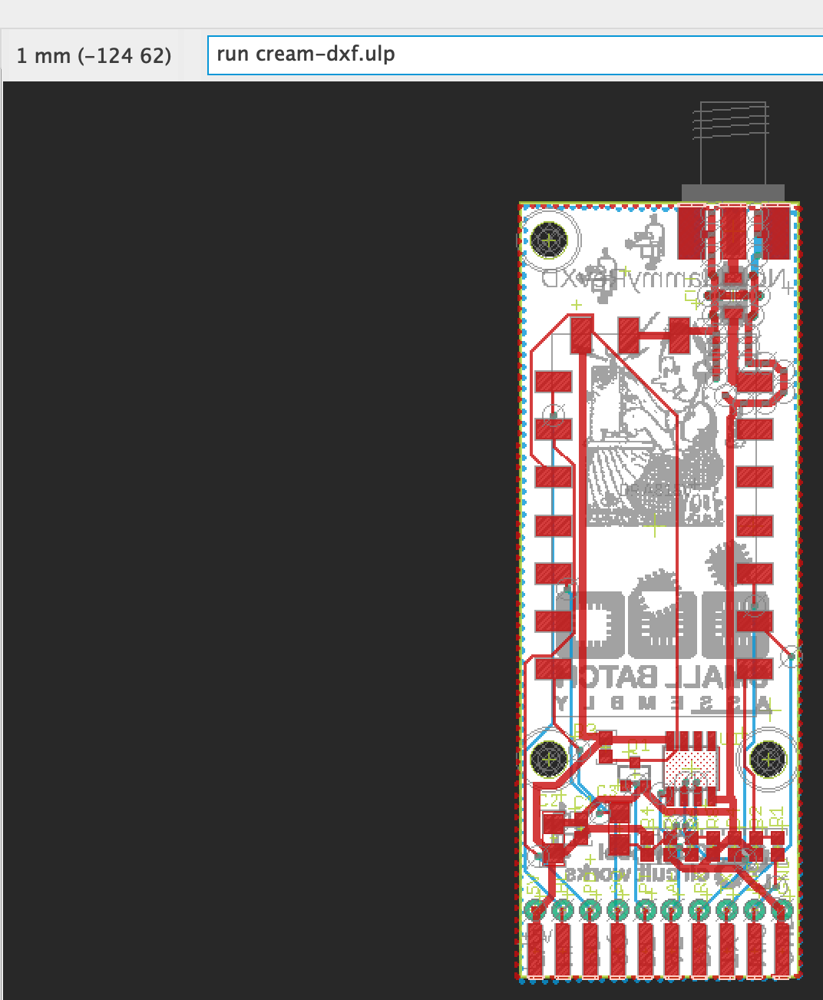

* Uncheck "Cut two times..."
* (Leave "Cut off corners..." unchecked.)
* (Leave shrink width at 0.05 mm, or alter as you see fit.)
* Click Run.

    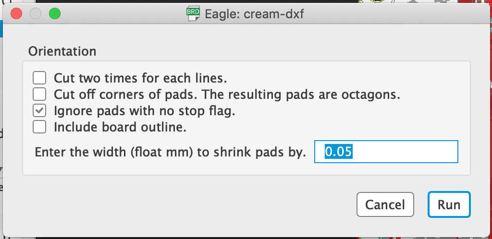

1. This will generate filename-tcream.dxf and filename-bcream.dxf files in the folder containing your filename.brd file.

    a. Note: DXF files do not typically encode units. This DXF exporter assumes millimeters.

2. Save these DXF files to a flash drive and take them to the K-40 Laser Cutter Computer

## Part 2. Setting up your Laser Cut Job

1. Login to the K-40 computer and open up "LaserWeb".

2. Click "Add Document"

    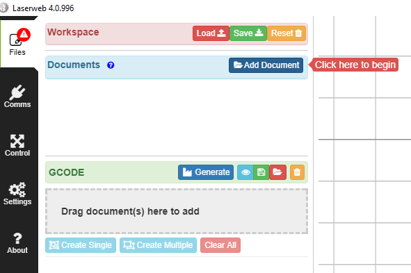

3. Find the DXF file you’ve created from Eagle.

    

    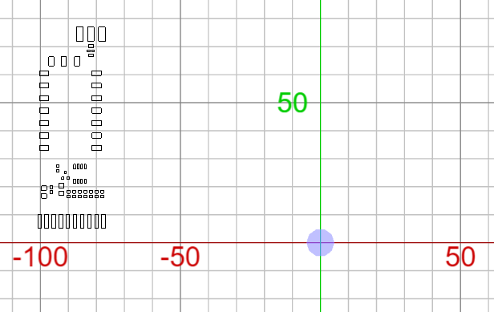

4. Drag the document from the Documents section to the GCODE section.

    

5. Keep the type of process as "Laser Cut".

6. Change the Cut Rate to a value between 1 and 50,000. A good rate to start with is 10,000.

7. Click the "Generate" button, and you should see your cut job turn red, with a green line between each shape. The green line is the path of the laser.

    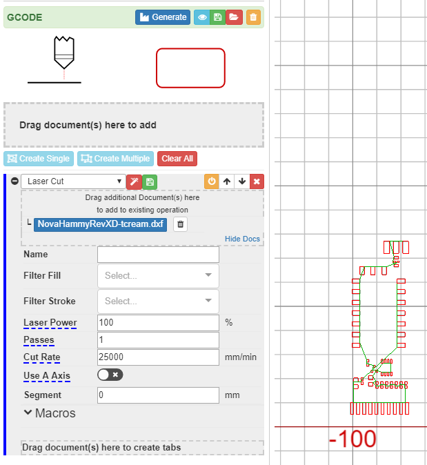

## Part 3. Setting up the Laser for Cutting

1. Cut a piece of parchment paper out approximately the size of the laser bed of the K-40 laser. 

2. Tape the parchment paper down with blue tape, and ensure that it is completely flat.

    

3. Place the board into the K-40 Laser bed

    a. It is also a good idea to tape down the board to keep it from moving.

    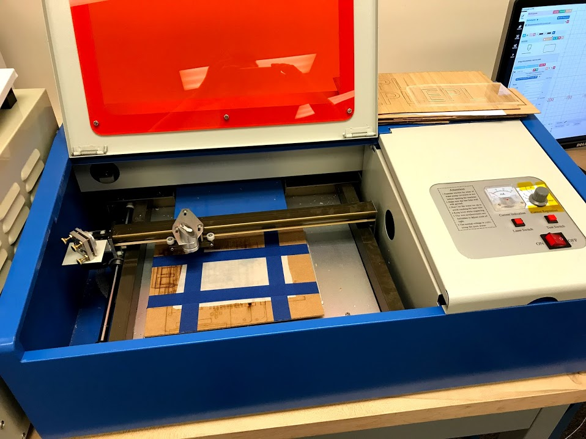

4. Turn on the CW-3000 Industrial Chiller

    {:width="600px"}

5. Turn on the Hakko Fume Extraction System

    {:width="600px"}

6. Turn on the K-40 laser.

    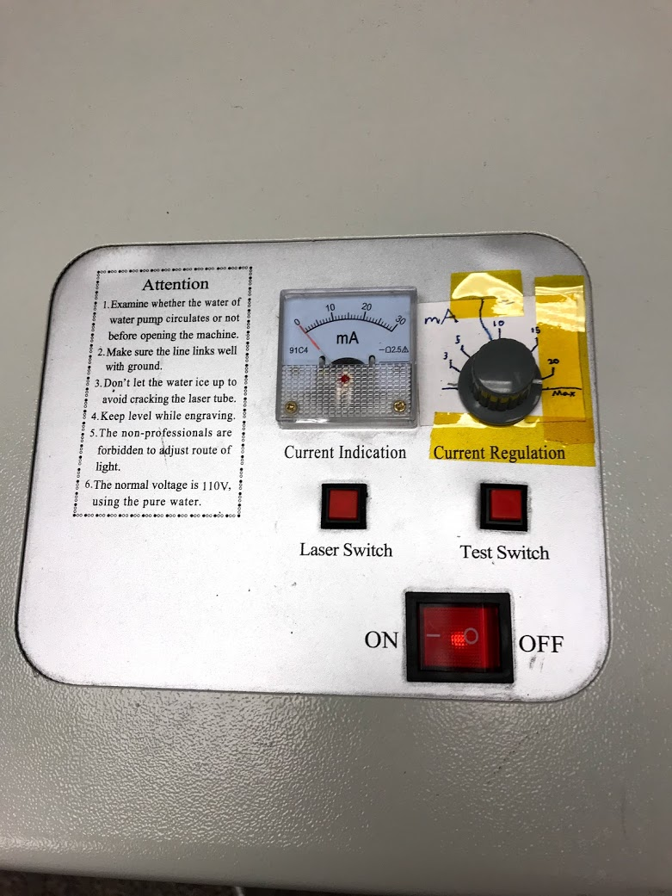

   a. Ensure that the laser switch is in the "Off" position for now.

    

   b. Ensure that the current regulation is set to the appropriate value.

    

## Part 4. Cutting your Stencil

1. On LaserWeb, click the Comms button on the left toolbar.

    

2. Click "Connect". The command line should show that the machine has connected. A blue dot should appear on the workspace that shows the current position of the laser head.

    

    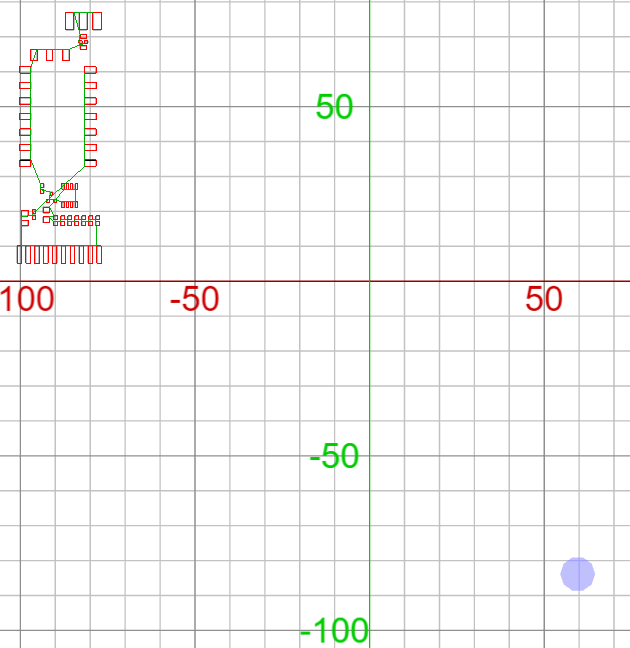

3. Click on the down arrow next to the X coordinate and click "Home X Axis".

    

4. Do the Same thing for the Y-Axis

    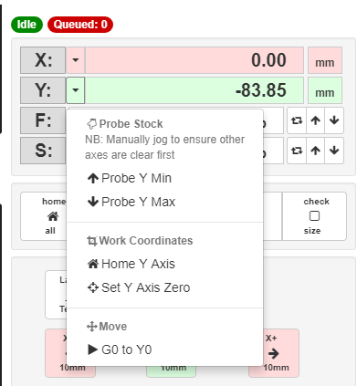

5. Use the Jog Buttons to move the laser head so that it is over the top left corner of your parchment paper.

    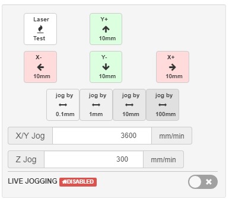

6. At this point you will probably need to move your artwork so that it is in a logical position relative to the laser head. To do this, click on "Files". Click on the document name to select it.

    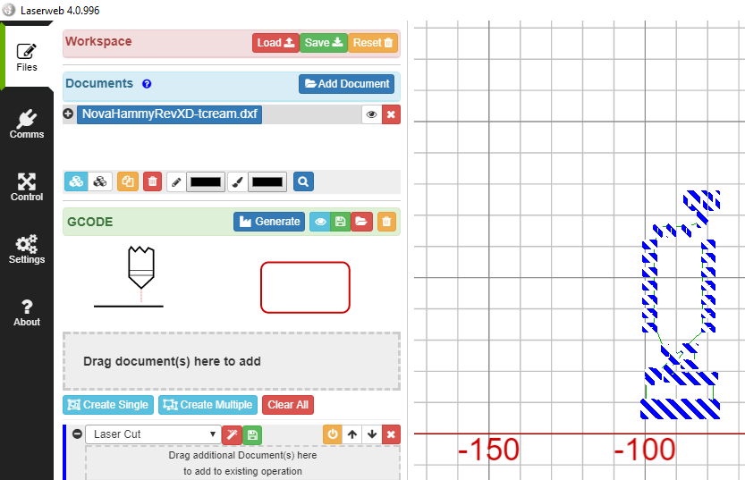

7. Drag it so that the job is to the bottom right of the laser head. Click on Generate to regenerate the job.

    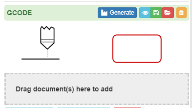

    

8. Open the Control menu again. Again ensure that the laser switch is in the off position, and run the job to ensure that the entire job will fit on your paper. (or use the jog buttons to jog across your job to see that it fits).

    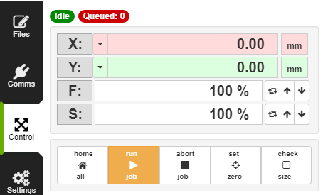

9. When you’re ready, move the laser head back into an appropriate position with the jog buttons and put the laser switch into the "On" position. Then hit “Run Job”.

10. If the laser doesn’t cut, go back to the Files tab and reduce the "Cut Rate". If the paper is burning too much (your holes will be too large), increase the cut rate.

    a. Note: Remember to click "Generate" after doing this or the changes won’t apply!

11. Move to a fresh piece of parchment paper if needed and run the job again.

    a. Should you ever need to abort a job that is in progress, you will need to click "Abort Job" and then “Clear Alarm” to be able to start cutting again.

    

## Part 5. Cleaning up and Shutting Down

1. Remove your stencil from the laser bed. If it all looks good, make sure that you toss any scraps of parchment paper that have been cut, and the blue tape. The board itself may remain in the laser cutter. 

2. Turn off the laser.

3. Turn off the Hakko Fume Extraction System

4. Turn off the CW-3000 Industrial Chiller.

5. Close the Laserweb Program.

