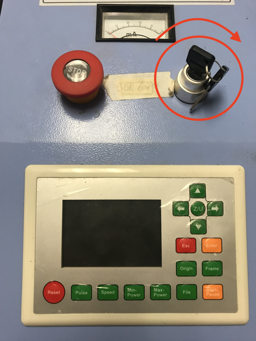
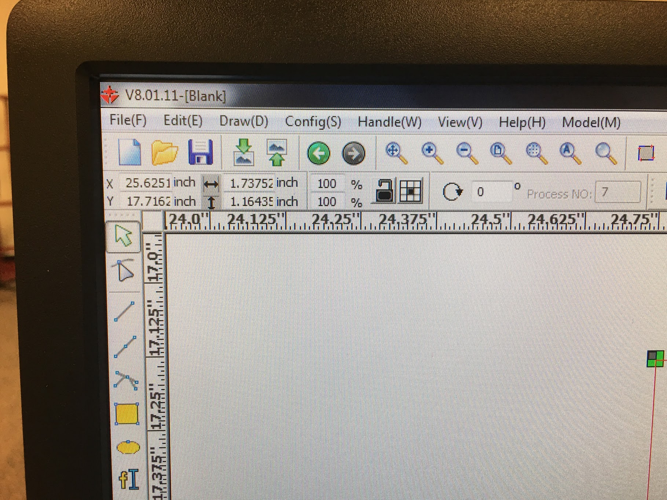
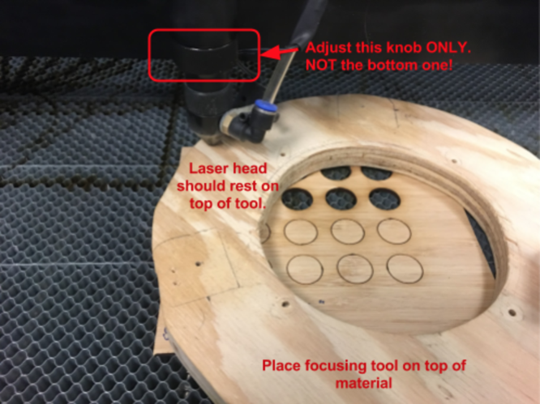
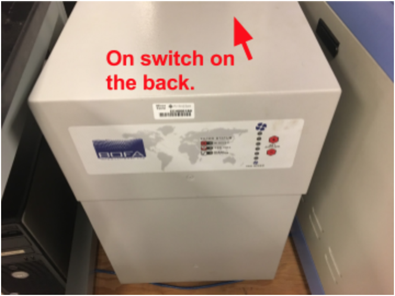
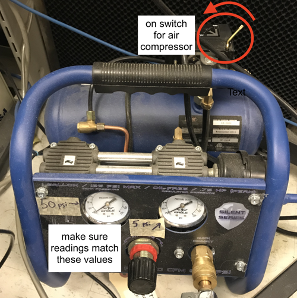


# Global TODOs 
- [X] Resize the images to something that's sane for the web.
- [X] Rename the images to something descriptive.
- [ ] Rearrange the secions. (see comment below)
- [ ] Add moar pix.
    - [ ] laser safety goggles.
    - [ ] Burned retina.


## Table of Contents
{:.no_toc}
* ToC
{:toc}


# About This Machine
## Materials
## Useful Links
## Machine Safety
### Lazor Beemz
### Fire
### High Voltage
## How to Get Help
# Using This Machine
## Setup
### Safety Checks
#### Reasons to E-Stop
### Turn Everything On
## Operation
### Laser Enable
### Run the Job
### Laser Disable
## Shutdown
## Cleanup
# Tips and Tricks
## Focusing the Laser
## Test Cuts
## Checking for Complete Cuts
## Multiple Passes
## Finishing and Assembly
## Part Design
## How to Make Tea With This Machine


# Materials
Ask a manager if you would like to cut any materials not on either of these lists.

## Pre-Approved
These materials are fine to use.
A mystery material that looks like one of these does not count!
For example, people often confuse polycarbonate and acrylic. 

{:class="table table-striped"}
| Material        | Minimum Thickness   | Maximum Thickness     |
| --------        | -----------------   | -----------------     |
| Acrylic         | 1/16 in             | 1/4 in                |
| Bamboo          | 1/32 in             | 1/4 in                |
| Cardboard       | 1/32 in             | 1/4 in                |
| Masking Tape    | 1 layer             | 2 layers              |
| Paper (Printer) | 1 sheet (held down) | 10 sheets (held down) |
| Poster Board    | normal              | normal                |
| Wood (General)  | 1/8 in              | 1/4 in                |
| Wood (Ply)      | 1/8 in              | 1/8 in                |

## Banned
It's never okay to cut these materials on the laser.

{:class="table table-striped"}
| Material                               | Problem
| --------                               | -------
| PVC (Polyvinylchloride)                | toxic, corrosive gas
| ABS (Acrylonitrile Butadiene Styrene)  | toxic gas
| Teflon, PTFE (Polytetrafluoroethylene) | toxic, corrosive gas
| Vinyl                                  | toxic, corrosive gas
| PC (Polycarbonate)                     | self-sustaining fire
| PE, HDPE, LDPE (Polyethylene)          | melts and splatters
| Architectural Modelling Board          | because
| Anything containing chlorine           | toxic, corrosive gas
| Anything containing fluorine           | toxic, corrosive gas

# General Notes
* This laser cutter will work with vector (usually DXF) files (for cutting and rastering) and image (usually JPG or PNG) files (rastering only).
* **DO NOT CUT ANY UNAPPROVED MATERIALS AS THEY CAN RELEASE NOXIOUS AND TOXIC FUMES**
* CAD Programs and DXF files:
	* Solidworks:
		* Open the *part* you wish to cut
		* Change the measurement system to \'mmgs\' (bottom right corner) and ensure your part has the correct dimensions in millimeters. (25.4mm/inch)
			* The main reason for bad DXF files from SolidWorks is using a different measurement system such as IPS(Inch, pound, second) or MKS(Meter, kilogram, second). Use your desired system to design the part but switch to mmgs afterwards to create the DXF file.
		* Right click the desired face you wish to create a pattern from and select "export DXF/DWG"
		* Complete the following prompts to save the file.

## Safety
* **Make sure the fire extinguisher is nearby.**
* IR beams are invisible but very damaging. Never run the laser with hood up, and always wear eye protection.
	* The orange glasses will help protect from indirect reflections from the laser, but will **NOT** protect from direct exposure. to the laser. 
	* Orange glasses are located in the large red tool box.
* It's good practice to keep the IR laser switched **OFF** (downward "0" position) until you are sure you are ready for cutting.
  The switch should not glow when the laser is disabled.
  

# Prepping the Laser 
## Chiller On
- Turn on the water chiller to the right of the laser.  
  **This step is important so the laser doesn’t overheat!**
    - It may sound an alarm for a few seconds but it should go away quickly.  
      

## Controller On
- Turn the key on the top of the laser to the on position.  
  

# Preparing your Job 
1. Login to the computer next to the laser cutter.
1. Open RDWorks.
1. Import the file you wish to work with.
    - Click File -> Import
        - You can import most vector files and images, but a safe bet is to use DXF vector files.  
           This image doesn't seem to clarify anything.
1. Check your job.
    - There are several issues that can happen upon importing a vector image.
		- If the vectors are messed up, in which case you will have to manually edit your job by clicking "Edit Nodes", and adding nodes to the parts you want to remove, or move. It takes practice.
        - Your vector image is scaled way too small. 
           Select your vector shapes, and check the width and length in the 
           upper left corner (not the x and y values, that is the position of your piece). 
           The program has a tendency to take inch dimensions and just turn 
           them into millimeters (not convert, just changes it, ex. 6 inches becomes 6 mm). 
           To fix this, you should export your vector file in millimeters. 
           Alternatively, you can fix this by highlighting all of your shapes, 
           and converting your dimensions in inches into millimeters 
           (multiply each dimension by 25.4) and entering that in for the 
           height and width. 

## Cut Power and Speed or Rastering
Image files (.jpg, .png, etc.) will **always** raster, meaning it will not cut. 
It will just etch the image onto the material. 
If you want to cut, you need to add vector curves.
These can be imported from other software or added directly in RDWorks.

Different materials and thicknesses will require different laser powers or speeds to cut through the material.

### Material Cut Settings

Below you can find some examples of cuts made in various materials.

#### 1/16" Clear Acrylic

#### 1/16" Bamboo

### Specify Cut Settings
In the upper right hand corner of RDWorks you should see a small window that will probably have a single black block followed by cut and speed settings. It is possible to use different cuts and speeds for different parts of your job by using different "colors" to identify different layers on your piece.

1. Click on the vector you wish to edit the cut settings for.  
   This image does not clarify anything.
1. Click on one of the colors at the bottom of the software to change it. The shape should change to that color and a new color and item should appear in your layer window in the upper right hand window.
    * Note: The color only identifies the layer of the vector.  
      
1. Double click on the layer you wish to edit in the upper right-hand window.  
   
1. In the dialog box that pops up, edit the speed of laser to your desired settings.
1. Edit the minimum and maximum power of the laser to your desired settings.
    * Usually you will just make the minimum and the maximum the same.
    * Sometimes it gives you the option to change two power settings. Just uncheck one of them.
1. You can change the cut type from cut (will just use the laser to etch the lines on your vector) to scan (will use the laser to ‘fill’ in your vector shape--usually used to etch opaque shapes)
    * Note: Scanning large images can take a very long time as opposed to cutting. If you can cut instead of scan, please do so. 
      Also make sure you are using much lower power settings and higher speed settings for scanning.

Any vector you change to this color will have those cut settings.

Alternatively, if you just want to use the same cut settings throughout your job, just change the single black layer that is there by default and directly edit the settings there.

## Aligning and Testing
1. When you think your job is ready in RDWorks, open the hood (make sure the IR laser switch is **still** OFF) and place your material under the laser head.
    1. The green square in RDWorks is laser head start position. It will usually be positioned to the upper left of your piece. So you should place your material down so the laser head is directly above the upper left of your material.

1. Adjust the lens height so the bottom edge of the purple tape is 2 in. from the surface of the material to cut.
    1. *Note: Be careful to not over-tighten the focusing knob!*

1. Close the hood, and click "Start" in the laser control on RDWorks.
    1. Since the IR laser shouldn’t be on yet, it will not burn your piece. This is just to make sure that the laser will stay on your piece and not cut off of it (which may damage the laser bed).

1. Once you are sure that the laser will stay on your piece, proceed to the next step.

## Final Prep
1. Before turning on the beam for cutting, turn on the air filter to the left of the laser. The switch is behind it.
   TODO: Replace this with an up-do-date image.
1. Then turn on the green air compressor to the right of the machine by pushing the red switch into the down position.
    - Air should be flowing out of the laser head continuously at this point. If it is not, check that the handle on the valve is zip-tied into the on position.
    - The air pressure in the line should be around 10 psi. Adjust the pressure using the knob to the right of the switch and read the pressure off of the right gauge.
    - Double check that a _gentle_ stream of air is leaving the end of the lens assembly. 
        - If it isn't, make sure the valve on the blue air line leading to the laser is open.

1. Press the "Laser" switch on the side of the cutter into the on position, turning on the IR laser.

1. Press start on RDWorks to start the cutting job.

## While the laser is Running

* Do NOT leave your job unattended. You must monitor it constantly in case of a fire and to ensure correct completion of your job.

* When the laser is running, do **NOT** open the hood.

* It is not recommended to stare at the cutting laser light. Eye damage may occur (even with protection).

* Eye protection is recommended (orange safety glasses).

* Press the **red emergency stop** knob on the machine to stop the job for any reason. 

# Finishing Up

1. Once your job is finished, turn the "Laser" switch on the side of the cutter off.
2. Open the hood and check that your job cut properly. 
    1. If it didn’t you may have to change your cut settings accordingly.
3. Clear the bed of any little pieces of material (these can cause fires if left there).
4. If you are completely done, follow the shut-off procedure in the following sequence:
    1. Turn off the air compressor.
    2. Turn off the air filter.
    3. Turn off the laser cutter by turning the key into the off position.
    4. Wait about 10-15 minutes before turning off the water chiller.
5. Close RDWorks. (saving your job is optional, but recommended)
