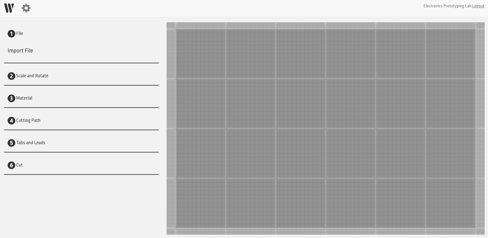
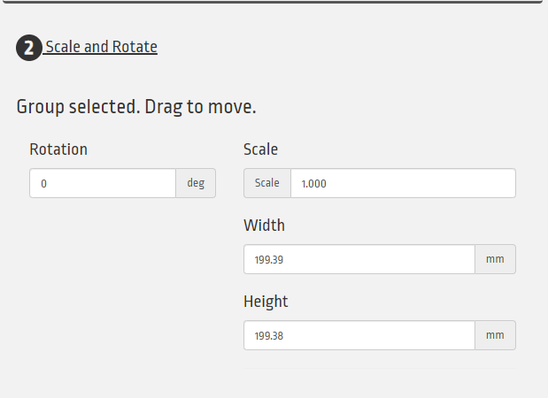
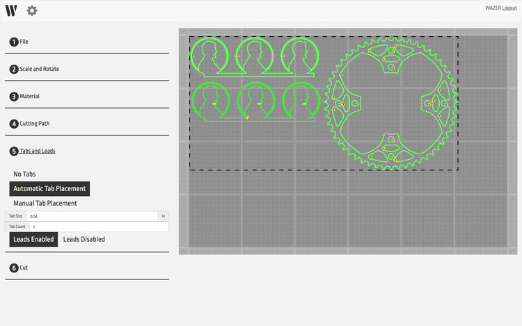



# Overview
- Username: EPLWazer
- Password: (It's written on the computer.)
- Default Units: mm
- Kerf (Nozzle Diameter): 0.9652mm
- Accepts .dxf and .svg files
    - .dxf files must be converted to vector paths
    - Unit default will be to inches if not clear, .dxf does not include units
    - .svg must be output as Plain
    - Must be in physical units and not pixels
    - Pictures and bitmaps will be ignored

Excessively small line segments will be deleted. Path ends and
beginnings that are very close to each other will be merged. Check for
overlapping segments. **Make sure cut groups are within the cut bed
boundary and within the bounds of your material.**

***\*Note about design: Waterjet Cutting works best with straight lines
and simple geometries. A part with a lot of curves, angles, or separate
holes will take far longer than one with long, straight lines.***

## Cut Group
Describes all the elements contained within a closed curve. All elements
will be locked in reference to each other.

## Split
If multiple closed curves are imported, they will stay referenced to
each other so can be moved about the cut bed together. The Split command
can be used to separate closed curves from each other which can then be
manipulated independently.

## Scaling/Rotation
Things can be scaled, this is especially important if there are import
errors.

Scaling can be done using a scaling factor or by changing the Width or
Height of the cut group which scales proportionally with the major axis

Things can be rotated to fit a lot of things on the bed.

## Material Settings
Wazer has a database of Material Settings that it uses to specify cut
rate and speed. Simply specify material and thickness and WAM will take
care of the rest. If the material is not already in the database, it can
be added manually by entering …

Materials are organized by TYPE, specific MATERIAL, and THICKNESS.

## Cut Paths
Once a design is imported into WAM, it is shown as a set of white curves
and depending on the tolerancing necessary, you can choose to have the
Wazer cut Inside, Outside, or directly on the curve (Centerline). Once
this is chosen a green curve will appear which represents the actual cut
path that Wazer will take.

## Tabs and Leads
Tabs help to keep the part in place during cutting, to improve accuracy,
and prevent pop-ups. WAM automatically incorporates tabs in default
locations and indicated by yellow marks on the interface. Tab locations
and sizes are based on cut path and size of material, this will not
usually need to be changed, but use your judgement and if the tab will
interfere with your design, then change its position by selecting Manual
Tab Placement and moving the tab by left-clicking and dragging. Tabs can
be added and removed by left-clicking as well. You may also choose to
get rid of all the tabs, but this is not recommended.

## Leads
Lead refers to the distance away from the Cut Path that the Wazer will
begin to pierce. Since the Wazer begins with a high-intensity piercing
cut, there is the potential to remove excess material that you did not
intend to lose. The location and size are shown in the interface by a
blue indicator.

## Cut Quality and Finalize
Cut quality is affected by cut rate, the faster a cut leads to lower
quality and vice versa.

Once you are happy with the settings, specify a file name and select
Generate Job File. This will export the final cut file which can then be
saved onto an SD card and put into the Wazer to cut.

## Material Library
Wazer comes with a continually updating library of Material Settings
under the Material tab of the website interface. These entries cannot be
edited.

## Adding/Editing Material
If there is a material that is not currently in the database, you may
add materials by selecting “Add/Edit Material” and filling in as many
fields as possible. You do not need to fill in multiple cut rates,
however, one is enough. The settings that are input by the user can be
edited by selecting the custom material and editing whichever fields are
necessary.

## Material Entry

| Field              | Description
| ----:              | :----------
| Material Category  | the type of material you will be cutting (metal, glass, plastic, etc)
| Material Name      | The particular material that you will be cutting (stainless steel, ceramic)
| Material Thickness | can be entered in inches or millimeters
| Cut Rate           | Coarse, Medium, Fine
| Cut Rate: Coarse   | barely cuts through, rough edges (especially on the back)
| Cut Rate: Medium   | Smooth edge with minor striations
| Cut Rate: Fine     | Highest quality, longest time, “almost sandblasted finish”
| Pierce Time        | This refers to the amount of time required to make the initial cut through the material

## Note:
The software (WAM) to use the Wazer is browser based. Access it at
[*wam.wazer.com*](https://wam.wazer.com/).

You will need the vector file to be cut (.svg or .dxf file).

By default the units are in mm. Your DXF file may be imported in as inches. Pay attention to the dimensions of your design after importing.

# Initial Setup
1. Log in at <http://wam.wazer.com>.
    - Username: EPLWazer
    - Password: (Same as the computer.)
    - You should see something similar to the image below once you have logged in:  
        
    - The left side is referred to as the Cut File Section which allows you to configure the Cut for the Wazer
    - The right side represents the WAZER Cut Bed and directly translates to the locations on which the patterns will be cut.
1. Start a new setup by clicking the "W" icon: 
    - By clicking the gear icon, you can change the settings of the job, such as the default units (changing from millimeters to inches).

# Starting your Job
## Import your file by clicking “Import File”.
1. Navigate to your design file, and open it. It should appear in your workspace.
1. You can drag the image anywhere you like on the workspace to position it.
    - Cut Groups: A cut group is an object in the Wam software that
        includes all elements within a closed curve. The concentric
        circles below would be considered a cut group.
    - Split: If several objects are imported that are not contained
        within a closed curve, they can be “split” and
        manipulated separately.  
        

## Scale and rotate your design as necessary to fit on your material.
1. Click Scale and Rotate
1. Select the design you wish to scale or rotate
1. You may rotate the object by entering the number of degrees you
    would like it rotated.
1. You may scale the object uniformly by adjusting the scale value, or
    you may adjust the height and width independently.  

## Select Material
1. It is important to know the type of material you are using in order
    for Wam to select the correct Cut Rate.
1. Wam comes with a constantly updating Material Library that covers
    dozens of Metals, Plastics/Rubbers, Ceramics/Stone, and even
    Carbon Fiber in varying thicknesses.
1. Navigate to the Material dropdown menu, and select the type of
    material as well as the thickness you require.

## Cutting Path
1. Select a group of elements and define the offset cutting path for
    these elements. If necessary, choose another group of elements and
    define their offset until every element has a cut path.
1. Selections include Inside, Outside, or Centerline.  

1. Cut Paths are highlighted in green and Tabs are in yellow

## Tabs and Leads
1. Wam automatically incorporates Tabs at default locations along each
    cut path and are indicated by a yellow indicator on the pattern.

1. Tab size is based on Material and will not likely need to
    changed, but be sure to check that its location will not interfere
    with your design.

1. Tabs can be moved, added or removed, by left clicking and dragging
    or simply left clicking.
    - It is possible to remove all Tabs, but this will likely lead
        to failure.
1. WAZER’s piercing cut is generally oversized in relation to the rest
    of the cut and Lead refers to the distance away from the cut path
    that WAZER will start the piercing cut in order to
    reduce interference.

## Cut Quality and Finalize
1. Cut Rate and Cut Quality have an inverse relationship so consider
    time constraints, minimum quality required, and the amount of raw
    material that you will be going through.
1. Specify a File Name (Last name\_First name\_Project descriptor)
1. Click Generate File, save to an SD card and Insert into the WAZER to
    begin the cut.

## Refer to [WAZER SOP](index) for how to use the unit itself.
