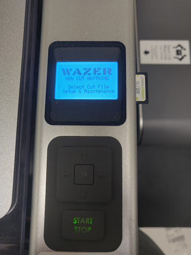
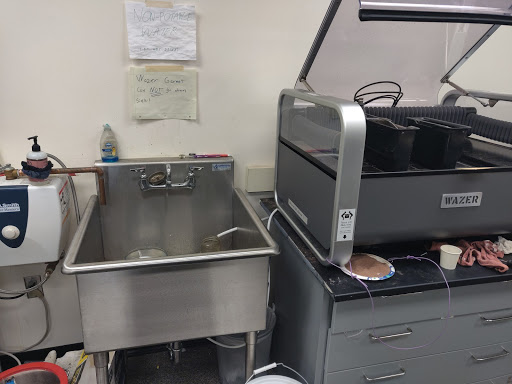
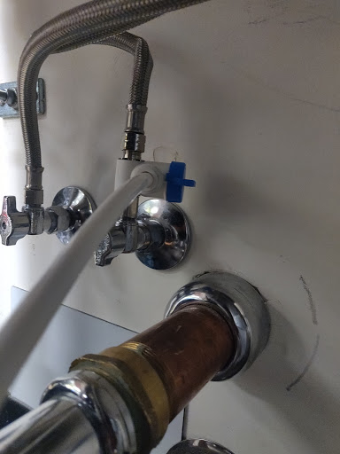
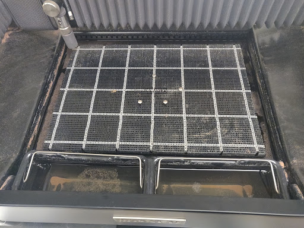
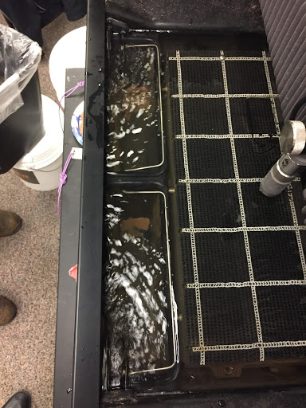
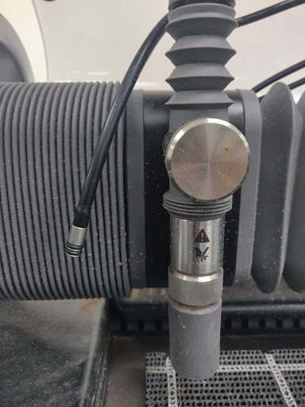
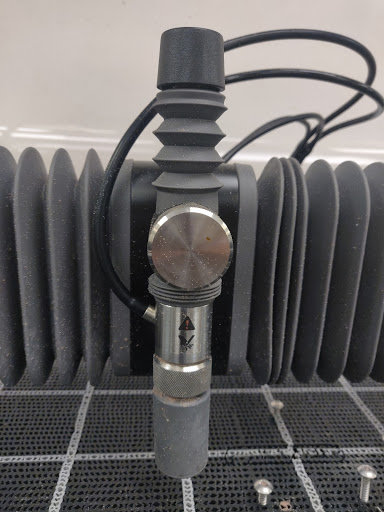
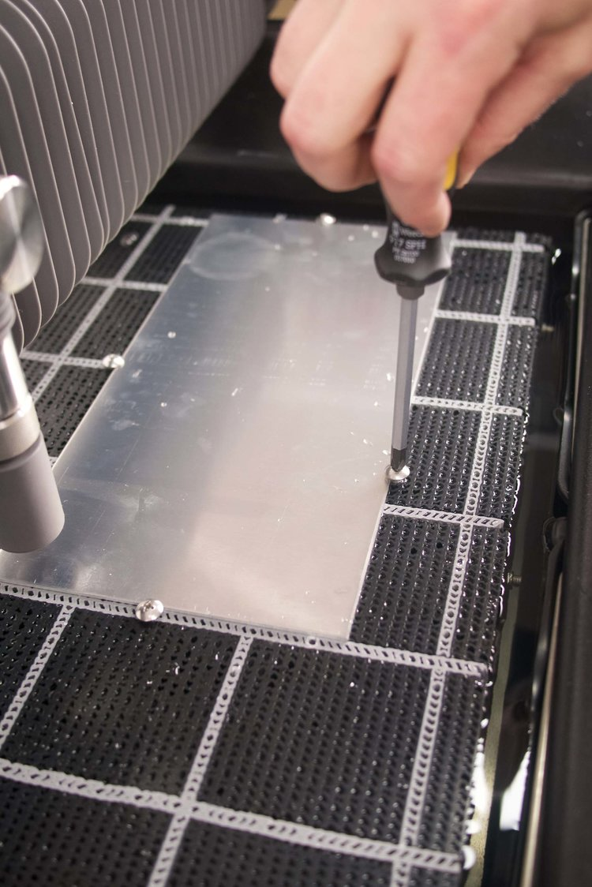

## Overview

We have a [Wazer](https://www.wazer.com/specs). Here is a quick overview:

The WAZER is a table-top waterjet cutter. Waterjet cutting uses a mixture of high-pressure water and an abrasive, it has the ability to cut through many materials. The WAZER is limited only by the repository of materials that are currently available on their online Material Library. In order to set up a cut, a 2D design must be created in an outside program (Solidworks, Illustrator,  Fusion360, Inkscape,  AutoCad, Onshape, etc) and then take a DXF or SVG file and upload it to WAM which is the slicing software. WAM is browser based and its use is outlined in a separate document [HERE](https://docs.google.com/document/d/e/2PACX-1vR1dXCqtqhrKVkHyGhJJPfcSqz3ATtw6Qzo6puR2IplyjMEwYYs1ZHa1CS6VhqkCRD1tPU0lUCym6Kx/pub)

## Anatomy

The WAZER has two main components: the main unit and the pump box. The pump box is the smaller enclosure on the right and is responsible for pressurizing the water that comes out of the building’s water system. The main unit is the larger of the two and contains the cut bed and control panel. The main unit is the only part of the WAZER that needs to be interacted with, the pump is fully controlled by the WAZER and should not be messed with.

The main unit has several parts to be aware of:

  

The **Abrasive Hopper** holds the garnet sand that is mixed with the pressurized water at the cutting head.

The **Enclosure** holds the cutting bed, water, used abrasive and material.

The **Control Panel** is the main interface through which the Wazer is operated.

The **SD Card Slot** is where cut files are uploaded to the Wazer.

The **Power Switch** is located underneath on the right side.

*Wazer insides (pictured above and below)*

*Cut bed size: 12" x 18"*

## Operation

The WAZER will not turn on unless there is a certain amount of water in the tank (about 2/3rds) but should not be attempted to run unless the water level is within ¼ inches of the top of the cut bed.

In order to run, the water supply from the building’s plumbing MUST be turned on otherwise the pump box will be severely damaged.

### Detailed Procedure

1. **Check water levels**
  - must be within 0.25 inches of the top of the cut bed, if not, add water manually using a large cup/container/bucket.

1. **Turn on water supply**
  - There is a sink to the left of the WAZER. Underneath there is a white valve and a blue lever switch. Make sure this switch is HORIZONTAL before continuing.

 

1. **Prepare abrasive system**
  - The WAZER assumes there is approximately 35 lbs of abrasive loaded at the start of each cut, and tracks the amount of abrasive by the length of cut versus measuring the amount in the hopper. Therefore, it is imperative that the hopper is fully loaded to ensure that you will not run out of abrasive during a long cut.
  - On the left side of the Main Unit, there is a drawer that has a bucket with two screens on top. Pull it out slowly and carefully. Remove the screens and if there is “enough” abrasive move on, otherwise take a cup and pour the abrasive through the screens (in case there are any large chunks) until there are small peaks poking above the screens.
    - Before adding sand to the hopper, make sure there is no wet sand in the hopper. If there is wet sand in the hopper, do not attempt to remove it. Get the manager on duty (if they're trained on the wazer) to service the hopper for you, as you don't want to be responsible for causing the equipment to need to be serviced.

**IMPORTANT: At no point should any abrasive material be physically added to the inside of the main tank, abrasive needs to be completely dry when it is mixed with the high pressure stream of water inside the cutting head.**

*The above amount pictured would constitute “enough”.*

  - Next, back to the inside of the main unit, take off the front bucket cover by pulling up on the metal handle  and empty out any used abrasive from the collection buckets and then carefully re-insert them. Water may be poured back into the WAZER and the used abrasive then scooped out and discarded into a provided 5-gallon bucket.

*The buckets with the metal handles need to be carefully removed and emptied before each new cut.*

1. **Plug the pump in**
  - The WAZER Main Unit and Pump need to be on SEPARATE circuits. The WAZER should be connected to the wall behind it and the pump power cable will need an extension cord to the backside of the column in the middle of the room, labeled 2D2-17.

Make sure there is nothing else plugged into these outlets. Use the orange extension cord in the bottom drawer of the table that the WAZER sits on.

  - Press RESET on both GFCI-breakers (attached to the power cables of both the WAZER and Pump Box), verify that there is a green light that turns on to be sure that power is supplied to each component.

1. **Turn WAZER on**
  - There is a rocker switch located underneath the tank of the WAZER on the right side, near the front. The on position is when the rocker is depressed nearest the right side. At this point, the screen for the Control Panel should turn on. Refer to the first picture in the **Anatomy** section for a better idea.
  - The Pump is fully controlled by the Main Unit and has no ON/OFF switch.

1. **Prime the plumbing**
  - Navigate to “Setup & Maintenance” on the Control Panel. Select “Maintenance”.
  - Remove the front bucket cover (which covers the abrasive collection buckets)
  - Select “Used Abr. Collect” and ensure that the stream of water that comes out is in a strong and steady stream. If it is not, navigate back to the “Setup & Maintenance” screen, down to “Peripheral Check” and select “LP Pump.” Let this run until the stream becomes strong and steady.

  - Next, in the “Setup & Maintenance” menu, select “Peripheral Check” and finally “HP Valve”
  - **IMPORTANT: Be sure to remove the Abrasive Hose End from the Cutting Head and move it somewhere that it is unlikely to get wet.**

  - Lift the Cutting Head at least ½ inch from the cutting bed, close the door, and press OK.
  - You are looking for a strong, mostly clear stream of water. If you can hear air hissing and the stream is white and irregular, select “HP Valve” a few more times until you achieve a strong, silent stream.
  - Replace the Abrasive Hose End, ensuring that it is fully seated, with both O-rings inside the Cutting Head

1. **Refer to the WAZER Software SOP to ensure that your cut is ready to go.**

1. **Insert SD Card, from the Main Menu go to “Select Cut File” and navigate to your file.**

1. **Lift the Nozzle and Home the WAZER**
  - The Wazer will now take you through several steps to make sure that it is safe to use
  - Twist Nozzle Lock Knob counter-clockwise to loosen, raise the nozzle all the way up and retighten. When you press OK on the WAZER it will home the Cutting Head to the upper left-hand corner of the cut bounds that you specified when slicing your design in Wam.

1. **Fasten Material**
  - This step is very important as it will help to ensure the longevity of not only the Cut Bed, but also the Cutting Head itself.
  - The Cutting Head should now be at the upper left-hand corner of where your piece will be cut out. When fastening, you want to make sure that the Cutting Head will not make contact with any screws or go off the bounds of the material. Using a piece of material that is comfortably larger than the piece you need is ideal.
  - The WAZER comes with mounting screws but if you feel you need smaller screw heads for your cut, ask a manager for help choosing alternate screws. Screws with coarse threads are ideal (wood/sheet metal screws), be sure to use at LEAST 3 and that the material cannot slide around when it is mounted.

1. **Nozzle Height**
  - Remove the Nozzle Height Tool from the top of the Cutting Head.
  - Loosen the Nozzle Lock Knob, and lower the nozzle to the material, placing the Height Tool in between the nozzle and the material. There is no need to press down and the height tool should be able to slide out easily once the Nozzle is tightened.
  - As long as the nozzle is set on the lip of the Height Tool and the Height Tool is set firmly on the material, you can tighten the Lock Knob and replace the Height Tool.
  - Press OK.

1. **Check Cut Extents**
  - The WAZER will give you an option to Check Cut Extents or perform a Dry Run. Perform AT LEAST one of these checks.
    - Cut Extents will give you the smallest rectangle that your piece fits into on the material
    - Dry Run will trace the entire path without releasing any water. This takes longer but is a more accurate picture of what the exact cut path is going to be.

1. **Ready to Cut**
  - Once you have completed all of the above steps, you are ready to cut. Select “Cut Material” and keep an eye on the WAZER while it cuts your material.
  - Take note of the time it takes for the cut to complete and let a manager on duty know, we need to track usage for maintenance purposes.

**IMPORTANT: DO NOT, UNDER ANY CIRCUMSTANCES OPEN THE COVER OF THE WAZER WHILE IT IS SET TO CUT.**

If the cut stops for any reason or throws up an error, get a manager before trying to move on and fix the problem yourself, even if the error seems minor.

1. **Shutdown and Clean-up**
  - Once your cut is complete, loosen the Lock Knob and raise the Cutting Head to its maximum height.
  - Perform a Tank Cleaning Procedure by Selecting “Setup & Maintenance” from the Main Menu, going into the Maintenance Menu and selecting “Tank Cleaning Cycle.” This should take about 2 minutes.
  - Return to the “Setup & Maintenance” menu and run the “Used Abr. Collect” until the water going into the Used Abrasive Buckets runs clear.
  - Take the Abrasive Hose End and dip it about 1 cm deep into the tank of water to loosen silt and shake it to remove whatever is inside. Leave it facing down to dry.
  - Empty the used abrasive buckets by dumping out the water and depositing the wet abrasive into the waste bucket. Leave them facing down on the cut bed to dry.
  - Leave the door to the WAZER open so that the internal surfaces can dry and make abrasive clean-up easier.

*finite*

