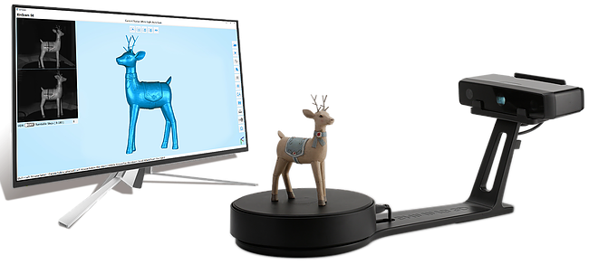

**Note: This is an alpha version of the SOP.**



# About this Machine

Short description of what this machine's good for plus its advantages, disadvantages, and quirks.

- The EinScan-SP is a 3D optical scanning tool featuring a 360° automatic turntable.
- It is able to scan a volume between 30×30×30 mm and 200×200×200 mm automatically on the turntable, 
or 1200 ×1200×1200mm manually using a fixed mount.
- This 3D scanner has high accuracy and scanning speed that provides high-resolution and quality 3D modeling of reverse enineering and design.

## Useful Links
- [Manufacturer Website](https://www.einscan.com/einscan-se-sp)
- [Quick Start Guide] - The majority of the material in this SOP is copied from this guide.
- More links to manufacturer docs, calculators, outside tutorials, etc.  
It's preferred that critical documents like manuals, TDSs, and MSDSs be kept in the repo when possible/allowed.
Markdown contains a feature to define a bunch of named links at the bottom of your document.
This can make it easier to create your "useful links" list and to refer to them throughout the document.

## Machine Safety
Include notes about possible hazards and the necessary procedures and equipment to avoid them.
Make it clear that the user is responsible for their own safety and that of the people around them while using this tool.

## How to Get Help
Include a list of which documents, websites, people, or mailing lists should be consulted in case of problems.

# Using this Machine
These sections describe the standard usage and common pitfalls.

## Calibration

Calibration MUST be performed any time the scanner or turntable is moved. It MAY be performed before every use, but it is not necessary. To calibrate:
1. Insert the calibration board into the board holder.
2. Place the calibration board and board holder onto the center of the turntable, facing the scanner.
3. Open the software as instructed in the Getting Started section aboves. Select EinScan-SP as the scanner model and go to NEXT. ~~Getting started with calibration button,~~ following the on-screen instructions to turn the calibration board in 3 directions. 
NOTE: Only rotate the calibration board during calibration, not at other times.

## Setup
Describe how to check that the machine is okay to use. Describe make the machine ready to use.

The recommended size for objects that can be scanned with the Shinning 3D Scanner is from 30x30x30 mm (1.2x1.2x1.2 in) to 250x250x250 mm (38x38x38 in) and the weight is less than 5 kg (11 lbs).

## Operation

### Before Scanning
- Click **New Project** to start new scan. 
- Choose **texture scan** if color texture is needed for scanning. Otherwise, choose **non-texture scan** (Texture scan is taking little longer time, and white balance test should be done before texture scanning).
- Place object on the turnable and ensure it is stable.
- Adjust the brightness setting to your object surface condition. Too much red appears on te object shown in the window means over bright.
- Click **Scan** to start scanning.

### After Scanning
- Edit scan: **SHIFT + Left mouse** to select redundant data. The redundant section will show as red. The tool bar on the top will allow you to do furter edit. **Click** to save data and exit single-piece edit.
- Sometimes, if one rotate can’t give you a full scan, you can place the object in other directions to capture the missing faces. After edit, save the current scanned data, the current data will be aligned to the last scanned data automatically.
- If automatic alignment fail during scanning, you can use manual alignment, although misalignment doesn't frequently happen.
- When the scan is completed, go mesh directly. Watertight or Unwatertight model can be selected due to your request. Watertight is closed model which can be printed directly. Unwatertight model is a non-closed model keeping the missing scanned area as it is, which is usually chosen for further design purpose in other program.
- Save the model. Available file format: **.asc**, **.stl**, **.obj**, and **.ply**

## Shutdown
- Press the touch switch for 1 second twice to turn the scanner off.

## Cleanup
- Make sure the machine is off.
- Pick up your parts.
- Put the calibration board back on the turnable so we don't lose it.

# Tips and Tricks
List some sections describing advaned techniques.

## Getting Started

## Using the Scanner

## Reference Material

[Quick Start Guide]: EinScan-SP-Quick-Guide-compressed.pdf
