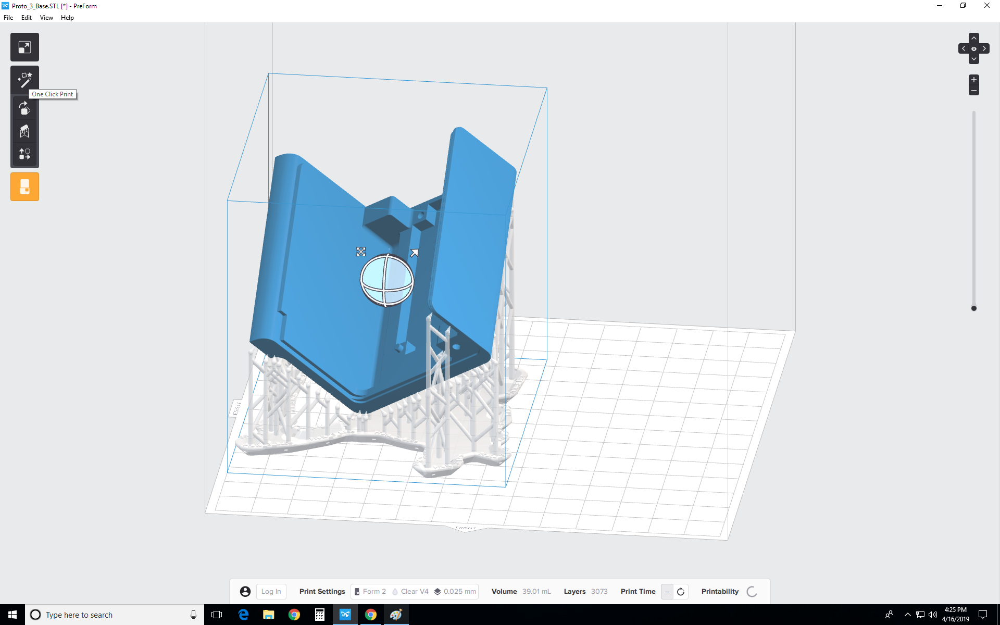
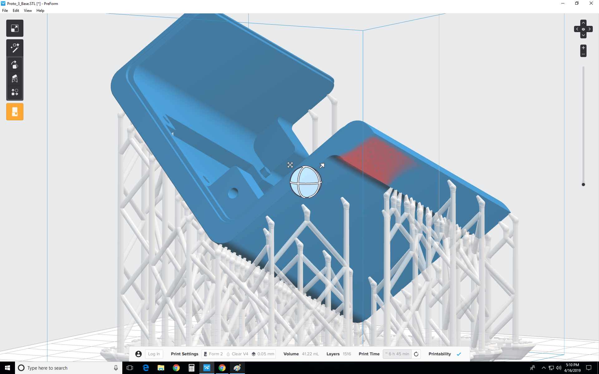
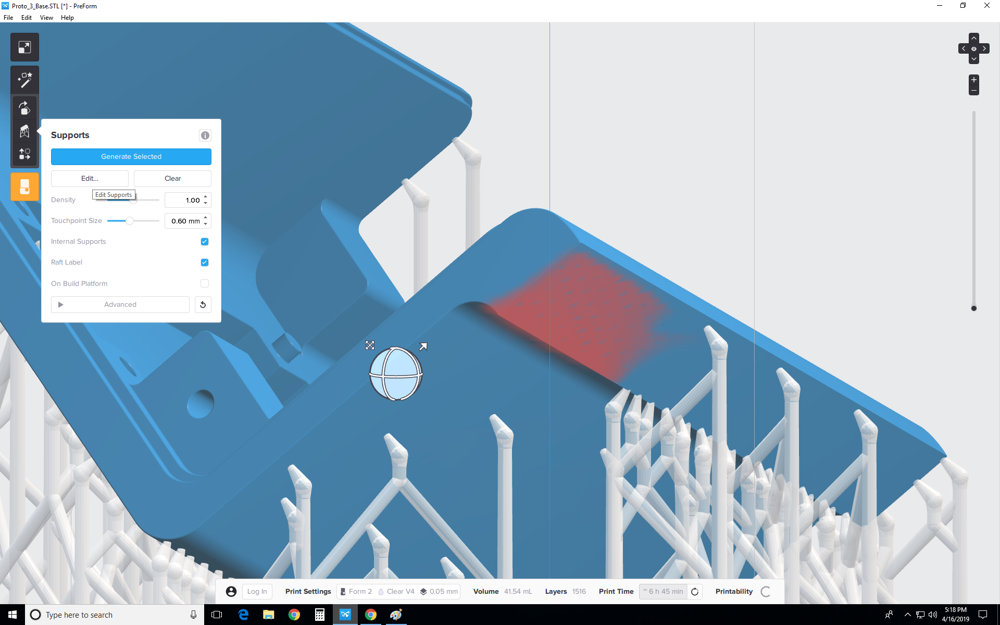
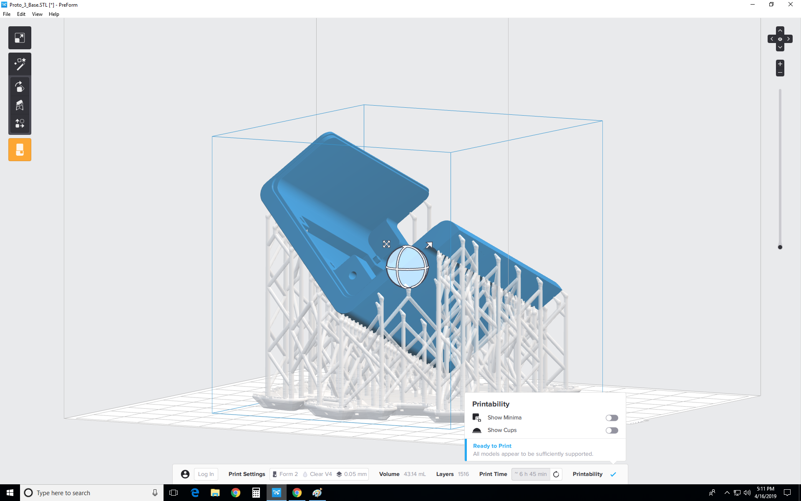
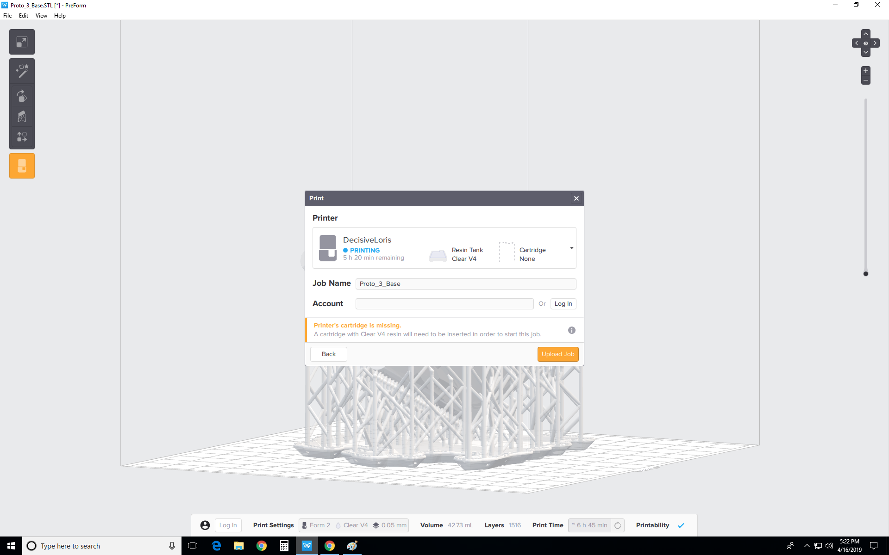

# [Form Labs Setup (For Managers)](Formlabs2QuickStartGuide)

# Before You Start
[Check the general 3D Printing Guide](/doc/equip/printer/3D-Printing-Checklist)

# Formlabs 2 Quick Start Guide 

Welcome to the EPL! We’re excited you’re getting started with
the Formlabs 3D printer. This guide will provide a walkthrough
for how to safely and efficiently use the Formlabs 3D printer so
you can get going with your project. If you have any additional
questions, please ask any EPL student managers for help, or
email us at EPL@pdx.edu.

## Printing:

Begin by opening the PreForm software located in the start menu on the workstation (eplmulti) near the formlabs machine. 

See the basic program layout,

### Importing Files:

Open your STL or OBJ files. 

### Setting Up:

Most parts print better when support at an angle. For automatic set-up select “One Click Print.”, PreForm will then use the sequence of tools to “orient all”, “generate all”, and “layout all.”. If you would like to do this manually use the FormLab tools to adjust the model “Orientation”, generate the “Supports”, and adjust the “Layout”. Most parts print better when the model is in the center; If possible keep the model layout in the center of the print bed.

### Printability:

Once you have the model set-up, check for Printability. If your model has unsupported areas your print may fail; rotate the model around and look for any red areas like the screenshot below.  

To correct this issue click on the PreForm tool "Supports", "Edit Supports", add in support points until the red area is eliminated, and click "Apply" to save the changes.

### Finalizing Design:

If there are no red/unsupported areas your print is ready! You can now view the 'Volume' of material used and the 'Print Time' on the Info Bar.

Finally, confirm your print's material and layer height, then click the orange print icon. Select which printer to upload the file to from the printer dialogue. Be sure to save your .form file into the queue folder.

*Remember to save your stl or obj files to your folder on the eplulti computer and add your print information into the queue.*

### Things to Remember Before You Print

- Make sure the build plate is empty and clean (the thing on top)
- Make sure the tank vent is open (giant shampoo bottle thing in back)
- Mark your print as "printing" in the queue
- Attach a sticky note for the print to the front of the printer containing:
    - Name of the person ordering the print
    - Name of the STL files
    - Price of the print

### Removing a Print

- Soak the print in the left alcohol bath
	- Start a timer on your phone for 30 minutes
	- Move the sticky note to the bath
	- Indicating on the sticky note when you started the soak 
	- Swirl the alcohol bath
- Soak again in the right bath
- Wash the part
- Remove the support material (bend and pry with palms)
- UV cure the part
	- Start a timer (30 to 60 min)
	- Move the sticky to the UV oven
	- Note the start time
- __Mark the print as "Finished" in the queue__
